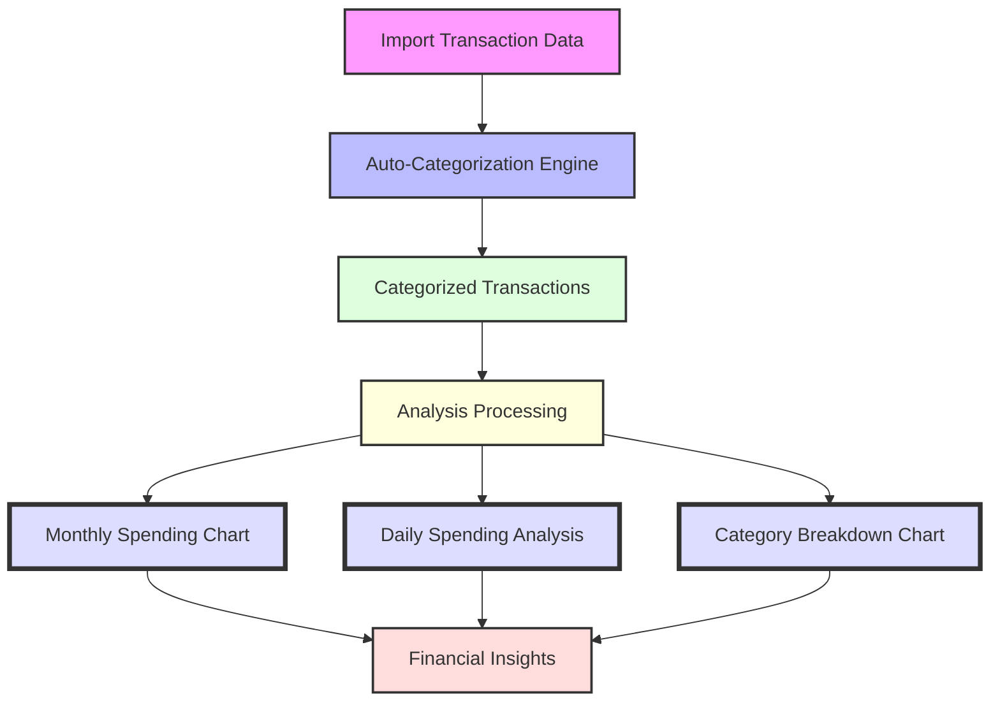

# Finance Tracker


A comprehensive personal finance tracking application built with React and Node.js that helps you monitor your spending, categorize transactions, and gain financial insights through visual analysis.

[](https://opensource.org/licenses/MIT)

## Overview

Finance Tracker is a full-stack web application designed to import, categorize, and analyze your financial transactions. The application supports multiple bank formats through a plugin-based import system, intelligent transaction categorization, and comprehensive financial reporting through interactive charts and visualizations.

## Key Features

- **Multi-Bank CSV Import System**: 
  - Supports AIB Bank and Revolute formats through a plugin-based architecture
  - Extensible system allows easy addition of new bank formats
  - Automatic format detection and transaction normalization

- **Transaction Management**:
  - Intelligent duplicate detection to maintain data integrity
  - Comprehensive transaction list with rich filtering and sorting options
  - Running balance calculation and currency support
  - Standardized date handling with support for multiple date formats (DD/MM/YYYY, MM/DD/YYYY, YYYY-MM-DD)
  
- **Smart Categorization System**:
  - Hierarchical categories with parent-child relationships
  - Pattern-based auto-categorization of similar transactions
  - Machine learning capabilities for transaction matching

- **Financial Analysis**:
  - Powerful visualizations including interactive line charts, bar charts, and category breakdowns
  - Period-over-period spending analysis with monthly and daily trend views
  - Expense tracking by category and parent category with detailed drill-down capability
  - Customizable date ranges and filtering options for all reports
  - Color-coded visualizations to easily distinguish between income and expenses

- **Modern Responsive UI**:
  - Material UI-based design system
  - Mobile-friendly responsive layout
  - Interactive data tables and visualizations

## Date Handling System

Finance Tracker implements a robust date handling system to ensure consistency across all parts of the application:

- **Standardized Date Format**: All dates are internally stored in YYYY-MM-DD ISO format for consistent processing
- **Multi-format Date Parser**: Automatically detects and converts various date formats:
  - European format (DD/MM/YYYY)
  - US format (MM/DD/YYYY)
  - ISO format (YYYY-MM-DD)
  - Handles different separators (/, -)
- **Database Standardization**: Includes utilities to scan and fix inconsistent date formats in the database
- **Consistent Display Options**: Display dates in ISO or European format based on user preference
- **Import Date Normalization**: All importers automatically standardize dates from bank CSV files

### Date Standardization Script

The application includes a database date standardization script (`server/scripts/standardize_database_dates.js`) that:
- Scans all transactions in the database
- Identifies dates in non-standard formats
- Converts them to the consistent YYYY-MM-DD format
- Maintains a log of all modified records

Run the standardization script to fix any legacy date inconsistencies:
```bash
cd server
node scripts/standardize_database_dates.js
```

## Technology Stack

### Frontend

- **Framework**: React with TypeScript
- **State Management**: React Hooks and Context API
- **UI Components**: Material UI
- **Data Visualization**: Chart.js with React wrappers
- **API Communication**: Axios for REST API calls
- **Build Tools**: Create React App with Webpack

### Backend

- **Runtime**: Node.js with Express
- **Language**: TypeScript
- **Database**: SQLite for portable, file-based data storage
- **ORM**: Custom data access layer
- **API**: RESTful endpoints with JSON payloads
- **Testing**: Jest with integration tests

## Database Schema

The application uses a relational database with the following key entities:

- **Transactions**: Core financial transaction records
- **Categories**: Hierarchical organization system for transactions
- **Parent Categories**: Top-level grouping of related categories
- **Transaction Categories**: Junction table for transaction categorization
- **Transaction Similarity Patterns**: Auto-categorization rules

For a complete database schema diagram, see the [ER Diagram](er-diagram.png).

## Project Structure

```
finance-tracker/
├── design/                  # Design documentation and architecture notes
├── public/                  # Static assets and sample data
│   └── sample-data/         # Sample CSV files for testing import
├── server/                  # Backend Node.js/Express application
│   ├── data/                # Data files
│   ├── queries/             # SQL queries and database operations
│   ├── scripts/             # Utility and maintenance scripts
│   ├── src/                 # Source code
│   │   ├── controllers/     # API endpoint controllers
│   │   ├── database/        # Database connection and utilities
│   │   ├── importers/       # CSV import plugins for different banks
│   │   ├── models/          # Data models
│   │   ├── routes/          # API route definitions
│   │   └── utils/           # Helper utilities
│   └── tests/               # Test suites and fixtures
├── src/                     # Frontend React application
│   ├── components/          # Reusable React components
│   │   └── charts/          # Data visualization components
│   ├── pages/               # Page components for routing
│   ├── services/            # API client services
│   ├── types/               # TypeScript type definitions
│   └── utils/               # Frontend utilities and helpers
```

## Getting Started

### Prerequisites

- Node.js (v14 or higher)
- npm (v6 or higher)
- Git

### Installation

1. Clone the repository:
   ```bash
   git clone https://github.com/yourusername/finance-tracker.git
   cd finance-tracker
   ```

2. Install frontend dependencies:
   ```bash
   npm install
   ```

3. Install backend dependencies:
   ```bash
   cd server
   npm install
   cd ..
   ```

### Running the Application

1. Start the backend server:
   ```bash
   cd server
   npm run dev
   ```

2. In a new terminal, start the frontend application:
   ```bash
   npm start
   ```

3. Open your browser and navigate to:
   ```
   http://localhost:3002
   ```

### Development Setup

1. To run backend tests:
   ```bash
   cd server
   npm test
   ```

2. To run frontend tests:
   ```bash
   npm test
   ```

## Usage Guide

### Importing Transactions

1. Navigate to the Transactions page
2. Click the "Import Transactions" button
3. Select your bank's CSV file or drag and drop it
4. The system will automatically detect the format and import valid transactions
5. A summary will display showing successfully imported transactions and any duplicates

### Categorizing Transactions

1. Click on any transaction in the transaction list
2. Select a category from the dropdown or create a new one
3. Choose to apply the same category to similar transactions automatically
4. The system will learn from your categorizations to improve future auto-categorizations

### Analyzing Your Finances

1. Navigate to the Analysis page
2. Select your desired date range and category filters
3. Explore the interactive visualization dashboard:
   - Monthly spending trends across all categories
   - Daily spending patterns for detailed analysis
   - Category breakdowns with color-coded income/expense differentiation
   - Year-over-year comparison capabilities

## Financial Analysis & Visualization

The Finance Tracker application includes three primary visualization types to help you gain insights into your spending habits and financial trends:



### 1. Monthly Category Spending Trends


This multi-line chart displays spending trends across all parent categories throughout the year:
- Each parent category is represented by a distinct color line
- View how spending in different categories changes month-to-month
- Interactive tooltips show exact spending amounts when hovering
- Year selection allows comparing spending patterns across different years

### 2. Daily Spending Analysis


This detailed chart provides a day-by-day breakdown of your spending within a selected month:
- See spending patterns for each day of the month
- All parent categories are represented with consistent color coding
- Identify spending spikes and regular patterns
- Detect unusual activity or understand weekly spending cycles

### 3. Category Breakdown Chart


This horizontal bar chart offers a detailed breakdown of spending within subcategories:
- View all subcategories within a selected parent category
- Color-coded bars distinguish between income (green) and expenses (red)
- Sort by amount to identify the largest spending areas
- Customizable by month and year for targeted analysis

## Managing Categories

1. Go to the Settings page
2. View and manage your category hierarchy
3. Create, edit, or merge categories
4. View and edit auto-categorization rules

## Extending the Application

### Adding a New Bank Import Format

The application uses a plugin architecture for transaction importers. To add support for a new bank:

1. Create a new importer class in `server/src/importers/` that implements the `TransactionImporter` interface
2. Register your importer in the `ImporterRegistry`
3. Implement the parsing logic for the specific CSV format
4. Add tests in `server/tests/importers/`

For detailed information, see [Transaction Importer Plugin Architecture](design/transaction-importer-plugin.md).

## Contributing

Contributions are welcome! Please feel free to submit a Pull Request.

1. Fork the repository
2. Create your feature branch (`git checkout -b feature/amazing-feature`)
3. Commit your changes (`git commit -m 'Add some amazing feature'`)
4. Push to the branch (`git push origin feature/amazing-feature`)
5. Open a Pull Request

Please ensure your code follows the existing style and includes appropriate tests.

## Roadmap

Future enhancements planned for this project:

- **Budgeting System**:
  - Create monthly budgets by category
  - Track spending against budgets
  - Send notifications for budget overruns

- **Multi-Account Management**:
  - Track transactions across multiple accounts
  - Transfer tracking between accounts
  - Consolidated financial view

- **Recurring Transaction Detection**:
  - Identify subscription payments
  - Forecast future recurring expenses
  - Notification for unusual changes in recurring amounts

- **Enhanced Data Export**:
  - Export to Excel, PDF, and CSV formats
  - Customizable reports and data views
  - Tax year summaries

- **User Authentication**:
  - Multi-user support
  - Role-based access control
  - Data privacy and sharing controls

## License

This project is licensed under the MIT License - see the LICENSE file for details.

## Acknowledgments

- [React](https://reactjs.org/) - Frontend framework
- [Express](https://expressjs.com/) - Backend framework
- [Chart.js](https://www.chartjs.org/) - Data visualization
- [Material-UI](https://material-ui.com/) - UI component library
