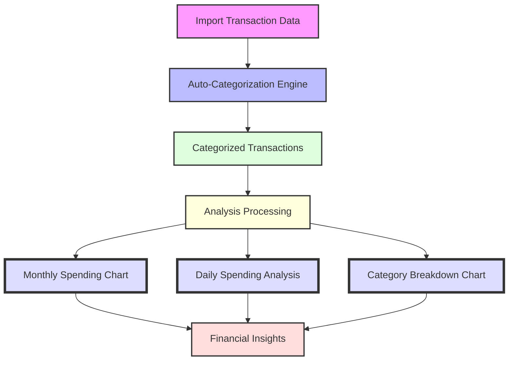

# Finance Tracker


A comprehensive personal finance tracking application built with React and Node.js that helps you monitor your spending, categorize transactions, and gain financial insights through visual analysis.

[](https://opensource.org/licenses/MIT)

## Overview

Finance Tracker is a full-stack web application designed to import, categorize, and analyze your financial transactions. The application supports multiple bank formats through a plugin-based import system, intelligent transaction categorization, and comprehensive financial reporting through interactive charts and visualizations.

## Key Features

- **Multi-Bank CSV Import System**: 
  - Supports AIB Bank and Revolute formats through a plugin-based architecture
  - Extensible system allows easy addition of new bank formats
  - Automatic format detection and transaction normalization

- **Transaction Management**:
  - Intelligent duplicate detection to maintain data integrity
  - Comprehensive transaction list with rich filtering and sorting options
  - Running balance calculation and currency support
  
- **Smart Categorization System**:
  - Hierarchical categories with parent-child relationships
  - Pattern-based auto-categorization of similar transactions
  - Machine learning capabilities for transaction matching

- **Financial Analysis**:
  - Powerful visualizations including interactive line charts, bar charts, and category breakdowns
  - Period-over-period spending analysis with monthly and daily trend views
  - Expense tracking by category and parent category with detailed drill-down capability
  - Customizable date ranges and filtering options for all reports
  - Color-coded visualizations to easily distinguish between income and expenses

- **Modern Responsive UI**:
  - Material UI-based design system
  - Mobile-friendly responsive layout
  - Interactive data tables and visualizations

## Technology Stack

### Frontend

- **Framework**: React with TypeScript
- **State Management**: React Hooks and Context API
- **UI Components**: Material UI
- **Data Visualization**: Chart.js with React wrappers
- **API Communication**: Axios for REST API calls
- **Build Tools**: Create React App with Webpack

### Backend

- **Runtime**: Node.js with Express
- **Language**: TypeScript
- **Database**: SQLite for portable, file-based data storage
- **ORM**: Custom data access layer
- **API**: RESTful endpoints with JSON payloads
- **Testing**: Jest with integration tests

## Database Schema

The application uses a relational database with the following key entities:

- **Transactions**: Core financial transaction records
- **Categories**: Hierarchical organization system for transactions
- **Parent Categories**: Top-level grouping of related categories
- **Transaction Categories**: Junction table for transaction categorization
- **Transaction Similarity Patterns**: Auto-categorization rules

For a complete database schema diagram, see the [ER Diagram](er-diagram.png).

## Project Structure

```
finance-tracker/
├── design/                  # Design documentation and architecture notes
├── public/                  # Static assets and sample data
│   └── sample-data/         # Sample CSV files for testing import
├── server/                  # Backend Node.js/Express application
│   ├── data/                # Data files
│   ├── queries/             # SQL queries and database operations
│   ├── scripts/             # Utility and maintenance scripts
│   ├── src/                 # Source code
│   │   ├── controllers/     # API endpoint controllers
│   │   ├── database/        # Database connection and utilities
│   │   ├── importers/       # CSV import plugins for different banks
│   │   ├── models/          # Data models
│   │   ├── routes/          # API route definitions
│   │   └── utils/           # Helper utilities
│   └── tests/               # Test suites and fixtures
├── src/                     # Frontend React application
│   ├── components/          # Reusable React components
│   │   └── charts/          # Data visualization components
│   ├── pages/               # Page components for routing
│   ├── services/            # API client services
│   ├── types/               # TypeScript type definitions
│   └── utils/               # Frontend utilities and helpers
```

## Getting Started

### Prerequisites

- Node.js (v14 or higher)
- npm (v6 or higher)
- Git

### Installation

1. Clone the repository:
   ```bash
   git clone https://github.com/yourusername/finance-tracker.git
   cd finance-tracker
   ```

2. Install frontend dependencies:
   ```bash
   npm install
   ```

3. Install backend dependencies:
   ```bash
   cd server
   npm install
   cd ..
   ```

### Running the Application

1. Start the backend server:
   ```bash
   cd server
   npm run dev
   ```

2. In a new terminal, start the frontend application:
   ```bash
   npm start
   ```

3. Open your browser and navigate to:
   ```
   http://localhost:3002
   ```

### Development Setup

1. To run backend tests:
   ```bash
   cd server
   npm test
   ```

2. To run frontend tests:
   ```bash
   npm test
   ```

## Usage Guide

### Importing Transactions

1. Navigate to the Transactions page
2. Click the "Import Transactions" button
3. Select your bank's CSV file or drag and drop it
4. The system will automatically detect the format and import valid transactions
5. A summary will display showing successfully imported transactions and any duplicates

### Categorizing Transactions

1. Click on any transaction in the transaction list
2. Select a category from the dropdown or create a new one
3. Choose to apply the same category to similar transactions automatically
4. The system will learn from your categorizations to improve future auto-categorizations

### Analyzing Your Finances

1. Navigate to the Analysis page
2. Select your desired date range and category filters
3. Explore the interactive visualization dashboard:
   - Monthly spending trends across all categories
   - Daily spending patterns for detailed analysis
   - Category breakdowns with color-coded income/expense differentiation
   - Year-over-year comparison capabilities

## Data Visualization Features

The Finance Tracker application offers powerful data visualization capabilities to help you gain insights into your spending habits and financial trends:



### Key Insights Provided

- **Spending Patterns**: Identify months with unusual spending across categories
- **Budget Adherence**: See at a glance if you're staying within your expected spending limits
- **Category Analysis**: Understand which subcategories consume most of your budget
- **Seasonal Trends**: Detect seasonal variations in your spending habits
- **Daily Habits**: Uncover spending patterns tied to specific days of the week
- **Year-over-Year Growth**: Track how your finances evolve over longer periods

### Technical Implementation

The visualization components are built using a robust technical stack designed for performance and interactivity:

- **Chart.js Integration**: All charts are implemented using Chart.js with React wrappers, providing a responsive and interactive visualization layer
- **Dynamic Data Processing**: Backend API endpoints in `analysisController.ts` aggregate transaction data and perform the necessary calculations for each visualization type
- **Real-time Filtering**: Charts respond instantly to date range and category filter changes using React's state management
- **Custom Tooltips**: Enhanced tooltip functionality provides detailed information when hovering over data points
- **Intelligent Color Schemes**: Automatic color generation based on category IDs ensures consistent coloring across different views
- **Adaptive Rendering**: Charts automatically adjust to different screen sizes and orientations
- **Currency Formatting**: Built-in internationalization support for proper currency display
- **Performance Optimizations**:
  - Lazy loading of chart data to minimize initial load time
  - Memoization of expensive calculations
  - Efficient data transfer format between backend and frontend

#### Example Chart Implementation

```tsx
// ParentCategoryLineChart.tsx (simplified)
const ParentCategoryLineChart: React.FC<Props> = ({ year, selectedMonth }) => {
  const [spendingData, setSpendingData] = useState<MonthlySpendingByParentCategory | null>(null);

  useEffect(() => {
    const fetchData = async () => {
      const data = await AnalysisService.getSpendingByParentCategoryPerMonth(year, selectedMonth);
      setSpendingData(data);
    };
    fetchData();
  }, [year, selectedMonth]);

  // Generate consistent colors based on category ID
  const generateColorForCategory = (id: number) => {
    const hue = (id * 137.5) % 360; // Golden ratio for color distribution
    return `hsla(${hue}, 70%, 60%, 0.7)`;
  };

  const chartData = {
    labels: spendingData?.months,
    datasets: spendingData?.categories.map((category, index) => ({
      label: category.name,
      data: category.data.map(value => Math.abs(value)),
      borderColor: generateColorForCategory(category.id),
      backgroundColor: generateColorForCategory(category.id).replace('0.7', '0.1'),
      borderWidth: 2,
      tension: 0.4,
      fill: false
    }))
  };

  return (
    <Box sx={{ height: 400, p: 2 }}>
      <Line data={chartData} options={options} />
    </Box>
  );
};
```

#### Analysis API Endpoint Example

```typescript
// analysisController.ts (simplified)
export const getMonthlySpendingByParentCategory = async (req: Request, res: Response) => {
  try {
    const { year, month } = req.query;
    
    // SQL query to aggregate spending by parent category per month
    const results = await db.query(`
      SELECT pc.id, pc.name, MONTH(t.date) as month, SUM(t.amount) as total
      FROM transactions t
      JOIN transaction_categories tc ON t.id = tc.transaction_id
      JOIN categories c ON tc.category_id = c.id
      JOIN parent_categories pc ON c.parent_id = pc.id
      WHERE YEAR(t.date) = ?
      GROUP BY pc.id, pc.name, MONTH(t.date)
      ORDER BY pc.id, MONTH(t.date)
    `, [year]);
    
    // Transform data for frontend consumption
    const categories = transformResultsToMonthlyData(results);
    
    res.json({
      months: getMonthNames(),
      categories,
      year: Number(year)
    });
  } catch (err) {
    console.error('Error getting monthly spending:', err);
    res.status(500).send('Server error');
  }
};
```

### Monthly Category Spending Trends


The Monthly Spending chart displays spending trends across all parent categories throughout the year:
- Interactive multi-line chart with each parent category represented by a distinct color
- Easily track how spending in different categories changes month-to-month
- Tooltip functionality showing exact spending amounts for each category
- Year selection to compare spending patterns across different years

### Daily Spending Analysis

The Daily Spending chart provides a granular view of your spending patterns within a selected month:
- Day-by-day breakdown of expenses across all parent categories
- Identify spending spikes and patterns throughout the month
- Helpful for detecting unusual activity or understanding weekly spending cycles
- Combined view with monthly trends for comprehensive analysis

### Category Breakdown Chart


The Category Breakdown visualization offers detailed insights into specific spending categories:
- Horizontal bar chart showing all subcategories within a parent category
- Color-coded bars differentiating between income (green) and expenses (red)
- Precise currency formatting with tooltip details
- Customizable by month and year for targeted analysis
- Helps identify the largest spending areas within each parent category

### Managing Categories

1. Go to the Settings page
2. View and manage your category hierarchy
3. Create, edit, or merge categories
4. View and edit auto-categorization rules

## Extending the Application

### Adding a New Bank Import Format

The application uses a plugin architecture for transaction importers. To add support for a new bank:

1. Create a new importer class in `server/src/importers/` that implements the `TransactionImporter` interface
2. Register your importer in the `ImporterRegistry`
3. Implement the parsing logic for the specific CSV format
4. Add tests in `server/tests/importers/`

For detailed information, see [Transaction Importer Plugin Architecture](design/transaction-importer-plugin.md).

## Contributing

Contributions are welcome! Please feel free to submit a Pull Request.

1. Fork the repository
2. Create your feature branch (`git checkout -b feature/amazing-feature`)
3. Commit your changes (`git commit -m 'Add some amazing feature'`)
4. Push to the branch (`git push origin feature/amazing-feature`)
5. Open a Pull Request

Please ensure your code follows the existing style and includes appropriate tests.

## Roadmap

Future enhancements planned for this project:

- **Budgeting System**:
  - Create monthly budgets by category
  - Track spending against budgets
  - Send notifications for budget overruns

- **Multi-Account Management**:
  - Track transactions across multiple accounts
  - Transfer tracking between accounts
  - Consolidated financial view

- **Recurring Transaction Detection**:
  - Identify subscription payments
  - Forecast future recurring expenses
  - Notification for unusual changes in recurring amounts

- **Enhanced Data Export**:
  - Export to Excel, PDF, and CSV formats
  - Customizable reports and data views
  - Tax year summaries

- **User Authentication**:
  - Multi-user support
  - Role-based access control
  - Data privacy and sharing controls

## License

This project is licensed under the MIT License - see the LICENSE file for details.

## Acknowledgments

- [React](https://reactjs.org/) - Frontend framework
- [Express](https://expressjs.com/) - Backend framework
- [Chart.js](https://www.chartjs.org/) - Data visualization
- [Material-UI](https://material-ui.com/) - UI component library
