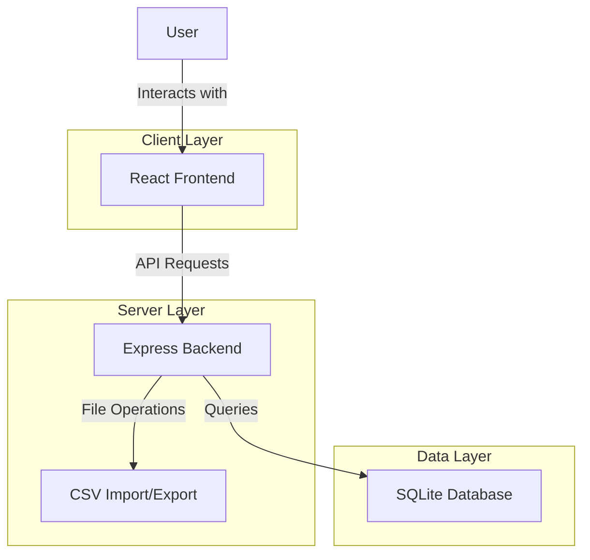
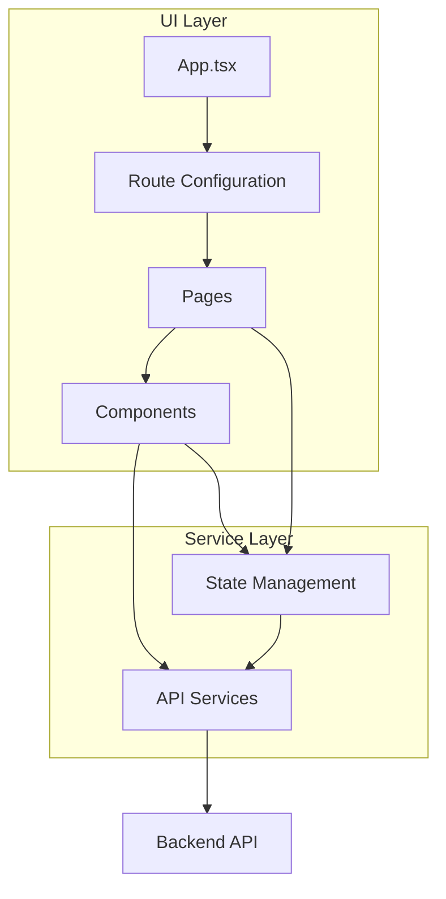
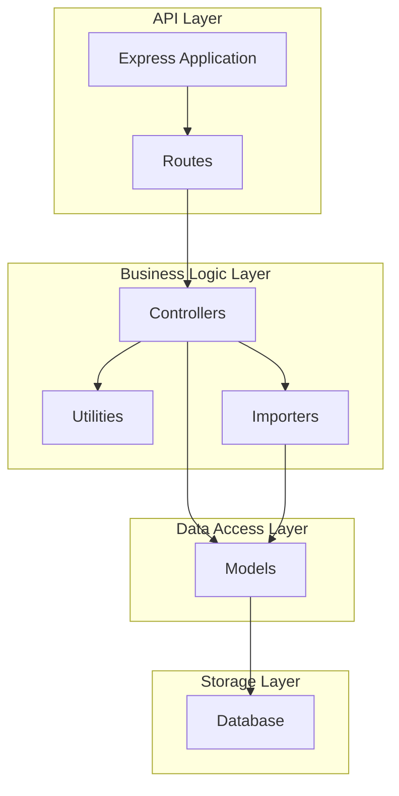
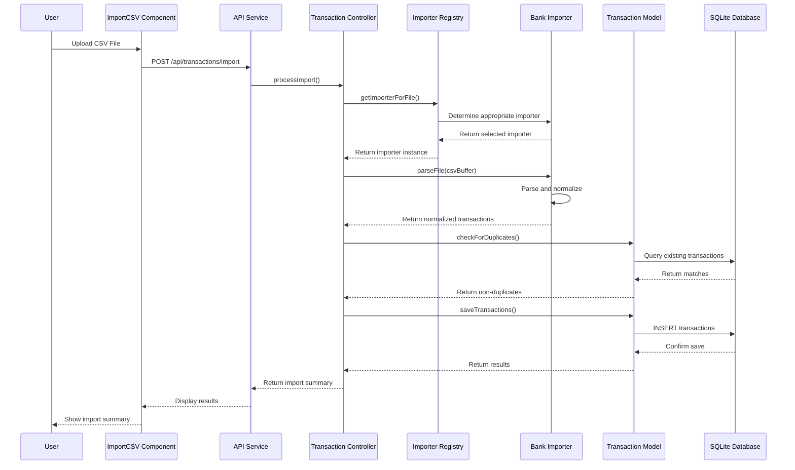
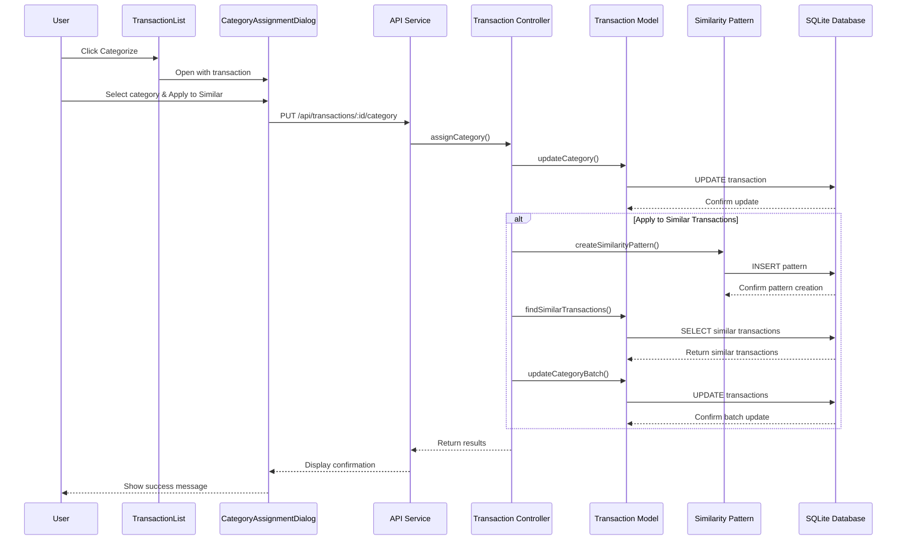
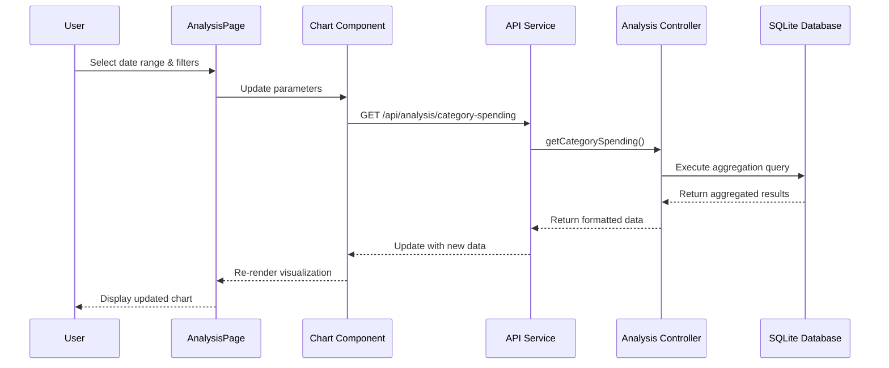
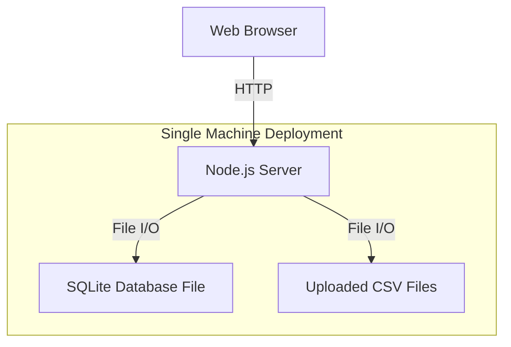

# Finance Tracker Architecture Overview

This document provides a high-level architectural overview of the Finance Tracker application, explaining how different components interact to create a complete personal finance management solution.

## System Architecture

The Finance Tracker follows a client-server architecture with clear separation of concerns:

### Key Architectural Principles

1. **Separation of Concerns**: Clear division between frontend (UI/UX), backend (business logic), and data storage
2. **RESTful API Design**: Standardized communication between client and server
3. **Pluggable Components**: Modular design for extensibility (e.g., bank importers)
4. **Single Responsibility**: Each component has a focused purpose
5. **DRY (Don't Repeat Yourself)**: Reusable code and abstractions throughout the codebase

## Frontend Architecture

The frontend follows a component-based architecture using React with TypeScript:

### Key Frontend Components

1. **Pages**: Container components representing entire views
   - `TransactionsPage.tsx`: Main transaction listing and management
   - `AnalysisPage.tsx`: Financial analysis and visualization
   - `SettingsPage.tsx`: Application configuration
   - `GroupedTransactionsPage.tsx`: Transactions grouped by categories

2. **Components**: Reusable UI elements
   - `TransactionList.tsx`: Displays transaction data in tabular format
   - `ImportCSV.tsx`: Handles file upload and import
   - `CategoryAssignmentDialog.tsx`: UI for categorizing transactions
   - Charts: Visualization components for financial data

3. **Services**: API communication layer
   - `api.ts`: Core API service
   - `categoryApi.ts`: Category-related operations
   - `analysisApi.ts`: Financial analysis operations
   - `db.ts`: Local storage utilities

4. **State Management**: Using React hooks and context for state management
   - Component-level state for UI-specific concerns
   - Context for shared state (categories, filters, etc.)
   - Custom hooks for reusable logic

## Backend Architecture

The backend follows an Express-based architecture with a modular structure:

### Key Backend Components

1. **Routes**: API endpoint definitions
   - `transactionRoutes.ts`: Transaction CRUD operations
   - `categoryRoutes.ts`: Category management
   - `analysisRoutes.ts`: Financial analysis endpoints

2. **Controllers**: Business logic implementation
   - `transactionController.ts`: Transaction operations
   - `categoryController.ts`: Category operations
   - `analysisController.ts`: Analysis and reporting

3. **Models**: Data structure and database operations
   - `Transaction.ts`: Transaction model and operations
   - `Category.ts`: Category model and operations
   - `ParentCategory.ts`: Parent category model
   - `TransactionSimilarityPattern.ts`: Auto-categorization patterns

4. **Importers**: Plugin system for importing transactions
   - `ImporterRegistry.ts`: Plugin registration
   - `AIBImporter.ts`: AIB bank format importer
   - `RevoluteImporter.ts`: Revolut format importer
   - `types.ts`: Importer interfaces and types

5. **Database**: SQLite database with custom ORM
   - `db.ts`: Database connection and query utilities

## Data Flow

### 1. Transaction Import Flow

### 2. Transaction Categorization Flow

### 3. Financial Analysis Flow

## Component Relationships

### Transaction Management

The core of the application revolves around transaction management:

1. **Import → Categorization → Analysis** pipeline
   - Transactions are imported from bank exports
   - Transactions are categorized (manually or automatically)
   - Categorized transactions enable meaningful analysis

2. **Transaction List → Transaction Detail → Category Assignment** workflow
   - Users view transactions in list format
   - They can select individual transactions for detailed view
   - From the detail view, they can assign or modify categories

### Category System

The category system provides the foundation for financial insights:

1. **Two-Level Hierarchy**
   - Parent categories for high-level grouping
   - Categories for specific transaction types

2. **Category Relationships**
   - Each category belongs to exactly one parent category
   - Each transaction ideally has one category assignment

3. **Auto-Categorization**
   - Transaction similarity patterns link descriptions to categories
   - Pattern matching enables automatic categorization of new transactions

## Deployment Architecture

The application uses a simple deployment architecture for personal use:

For more advanced deployments:
- Frontend could be deployed to static hosting (Netlify, Vercel)
- Backend could be containerized (Docker)
- Database could be upgraded to a managed database service

## Performance Considerations

1. **Data Volume Handling**:
   - SQLite is sufficient for personal finance data (thousands of transactions)
   - Pagination implemented for transaction lists
   - Indexed queries for efficient retrieval

2. **Import Performance**:
   - Stream processing for CSV imports
   - Batch inserts for database efficiency
   - Duplicate detection using indexed queries

3. **Analysis Optimization**:
   - Pre-aggregated data for common time periods
   - Client-side caching of analysis results
   - Optimized SQL queries for aggregations

## Security Considerations

1. **Data Security**:
   - Local storage of financial data
   - No cloud dependencies by default
   - File-based database allows easy backup

2. **Input Validation**:
   - Strict validation for all imported data
   - Sanitization of user inputs
   - Type checking with TypeScript

3. **Future Authentication**:
   - Prepared for future multi-user support
   - Authentication system design planned

## Conclusion

The Finance Tracker architecture provides a solid foundation for personal finance management with a focus on transaction categorization and analysis. The modular design allows for future expansion and feature enhancements while maintaining a clean separation of concerns between system components.

The plugin-based import system, hierarchical categorization, and flexible analysis tools work together to create a comprehensive solution that can adapt to various financial tracking needs.
