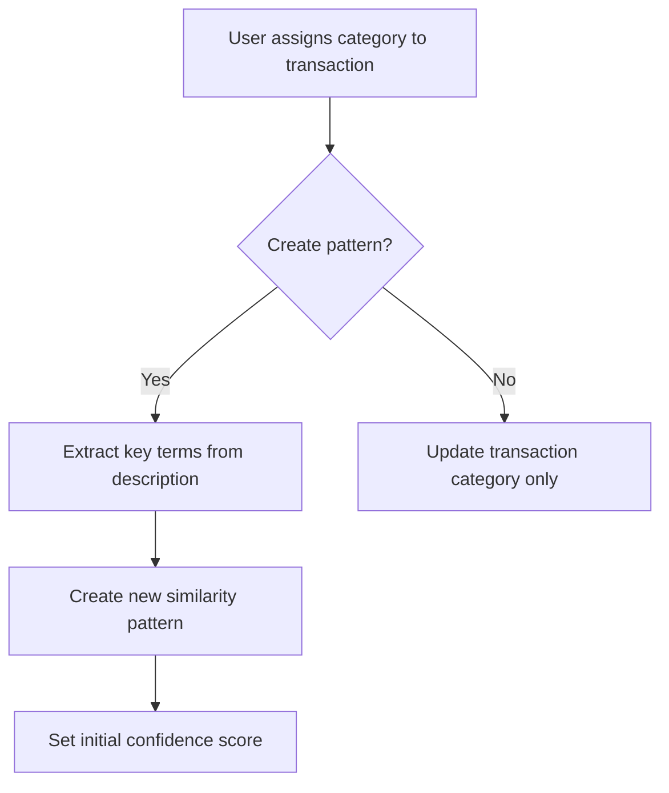
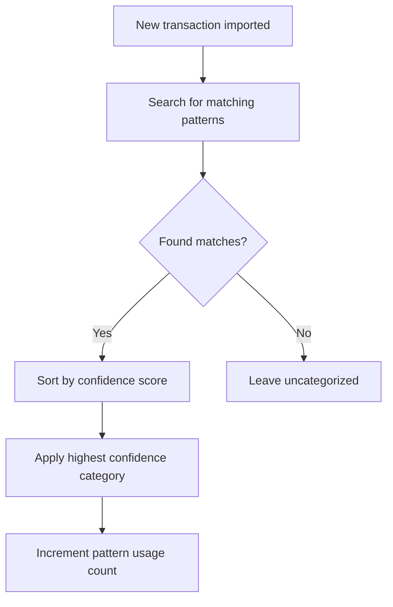

# Auto-Categorization System

This document outlines the auto-categorization system used in the Finance Tracker application. The system automatically assigns categories to imported transactions based on pattern matching and machine learning techniques.

## Overview

The auto-categorization system provides an intelligent way to categorize transactions without manual intervention. It works by:

1. Learning from manual categorizations made by users
2. Building a database of transaction patterns
3. Applying these patterns to new transactions
4. Continuously improving through usage statistics and feedback

## Core Components

### Transaction Similarity Patterns

The heart of the system is the `transaction_similarity_patterns` table, which stores patterns that link transaction descriptions to specific categories:

```sql
CREATE TABLE transaction_similarity_patterns (
  id INTEGER PRIMARY KEY AUTOINCREMENT,
  pattern_type TEXT NOT NULL,
  pattern_value TEXT NOT NULL,
  parent_category_id INTEGER,
  category_id INTEGER,
  confidence_score REAL NOT NULL DEFAULT 1.0,
  created_at TIMESTAMP DEFAULT CURRENT_TIMESTAMP,
  updated_at TIMESTAMP DEFAULT CURRENT_TIMESTAMP,
  usage_count INTEGER DEFAULT 0,
  FOREIGN KEY(category_id) REFERENCES categories(id),
  FOREIGN KEY(parent_category_id) REFERENCES parent_categories(id)
)
```

### Pattern Types

The system supports multiple pattern types for flexible matching:

1. **Exact Match**: The transaction description must match exactly
   - Example: `"AMAZON PRIME"` will only match transactions with that exact description

2. **Contains**: The transaction description must contain the pattern as a substring
   - Example: `"AMAZON"` will match "AMAZON PRIME", "AMAZON.COM", etc.

3. **Regex**: The pattern is a regular expression
   - Example: `"UBER.*EATS"` will match "UBER EATS", "UBEREATS", etc.

4. **Fuzzy Match**: Uses Levenshtein distance to find similar descriptions
   - Example: With a pattern for "STARBCKS", it can still match "STARBUCKS"

### Confidence Scoring

Each pattern has a confidence score (0.0-1.0) that indicates how reliable the pattern is:

- Patterns created from exact matches typically start with higher confidence (1.0)
- Patterns that match multiple different categories may have lower confidence
- Confidence scores adjust based on successful/unsuccessful categorizations

### Usage Tracking

The system tracks how often a pattern is used:

- Frequently used patterns with successful categorization gain higher confidence
- Patterns that are overridden by manual categorization lose confidence
- Usage statistics help identify the most valuable patterns

## Categorization Process

### 1. Manual Categorization Learning

When a user manually categorizes a transaction:



### 2. Apply to Similar Transactions

When a user chooses to "Apply to Similar Transactions":

```mermaid
graph TD
    A[User selects "Apply to Similar"] --> B[Find similar uncategorized transactions]
    B --> C[Apply same category to matches]
    C --> D[Create similarity pattern]
    D --> E[Set confidence based on match quality]
```

### 3. Auto-Categorization on Import

When new transactions are imported:



## Implementation Details

### Key Files

- `server/src/models/TransactionSimilarityPattern.ts`: Model definition
- `server/scripts/create-new-patterns.js`: Pattern generation utility
- `server/src/controllers/transactionController.ts`: Categorization logic

### Pattern Generation Algorithm

1. **Description Preprocessing**:
   - Convert to lowercase
   - Remove common noise words and special characters
   - Extract key terms

2. **Pattern Creation**:
   - For recurring vendors (e.g., utilities, subscriptions), use exact matches
   - For varied vendors (e.g., restaurants, retail), use partial matches
   - For complex cases, use regex patterns

3. **Pattern Selection**:
   ```javascript
   function getBestPatternMatch(transaction, patterns) {
     const matches = patterns
       .filter(pattern => matchesTransaction(transaction, pattern))
       .sort((a, b) => b.confidence_score - a.confidence_score);
     
     return matches.length > 0 ? matches[0] : null;
   }
   ```

### Match Quality Assessment

The system assesses match quality through several factors:

1. **Description Similarity**: How closely the transaction description matches the pattern
2. **Amount Consistency**: Whether the transaction amount is consistent with previous matches
3. **Temporal Consistency**: Whether the transaction timing is consistent with patterns
4. **Override History**: Whether users have previously overridden the auto-categorization

## Current Limitations and Future Improvements

### Limitations

1. **Context Insensitivity**: The current system focuses mainly on description matching without considering wider transaction context
2. **Cold Start Problem**: New installations require manual categorization to build up patterns
3. **Ambiguous Merchants**: Some merchants may legitimately belong to multiple categories (e.g., Amazon purchases could be groceries, electronics, etc.)

### Planned Improvements

1. **Machine Learning Enhancement**:
   - Incorporate transaction amount ranges into matching
   - Use temporal patterns (day of week, month) for better matching
   - Train a classification model on multiple transaction attributes

2. **Pattern Refinement**:
   - Auto-merge similar patterns to reduce redundancy
   - Split overly broad patterns that cause categorization errors
   - Periodically clean up unused or low-confidence patterns

3. **User Feedback Loop**:
   - Collect explicit feedback on auto-categorization accuracy
   - Implement "suggest category" feature with confidence thresholds
   - Provide categorization explanations ("categorized as X because...")

4. **Advanced Pattern Generation**:
   - Use NLP techniques to extract more meaningful patterns
   - Implement vendor name extraction from complex descriptions
   - Create pattern hierarchies for better organization

## Conclusion

The auto-categorization system provides a powerful way to reduce manual categorization effort while improving the quality of financial analysis. By learning from user behavior and continuously refining patterns, the system becomes more accurate over time, providing a personalized categorization experience.
