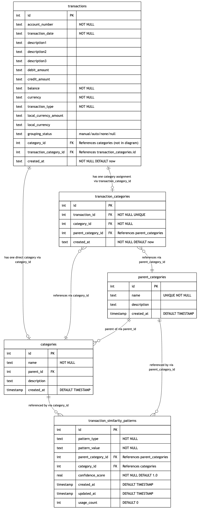

# Finance Tracker Database Schema

This document provides a comprehensive description of the Finance Tracker database schema, detailing the tables, relationships, and data flow for transaction management, categorization, and financial analysis.

## Entity-Relationship Diagram

## Tables

### transactions

The core table that stores all financial transactions imported from various bank sources.

| Column | Type | Constraints | Description |
|--------|------|-------------|-------------|
| id | INTEGER | PRIMARY KEY | Unique identifier |
| account_number | TEXT | NOT NULL | Account identifier |
| transaction_date | TEXT | NOT NULL | Date of transaction |
| description1 | TEXT | | Primary description field |
| description2 | TEXT | | Secondary description field |
| description3 | TEXT | | Tertiary description field |
| debit_amount | TEXT | | Money out (expenses) |
| credit_amount | TEXT | | Money in (income) |
| balance | TEXT | NOT NULL | Account balance after transaction |
| currency | TEXT | NOT NULL | Currency code (e.g., EUR, USD) |
| transaction_type | TEXT | NOT NULL | Type classification |
| local_currency_amount | TEXT | | Amount in local currency for international transactions |
| local_currency | TEXT | | Local currency code for international transactions |
| grouping_status | TEXT | | Categorization status: 'manual', 'auto', 'none', or NULL |
| category_id | INTEGER | FOREIGN KEY | Direct reference to categories (legacy field) |
| transaction_category_id | INTEGER | FOREIGN KEY | Reference to transaction_categories.id |
| created_at | TEXT | NOT NULL DEFAULT now | Record creation timestamp |

### parent_categories

Top-level category groupings that organize related categories (e.g., "Housing", "Transportation").

| Column | Type | Constraints | Description |
|--------|------|-------------|-------------|
| id | INTEGER | PRIMARY KEY | Unique identifier |
| name | TEXT | UNIQUE NOT NULL | Parent category name |
| description | TEXT | | Optional description |
| created_at | TIMESTAMP | DEFAULT TIMESTAMP | Record creation timestamp |

### categories

Specific transaction categories that belong to parent categories.

| Column | Type | Constraints | Description |
|--------|------|-------------|-------------|
| id | INTEGER | PRIMARY KEY | Unique identifier |
| name | TEXT | NOT NULL | Category name |
| parent_id | INTEGER | FOREIGN KEY | Reference to parent_categories.id |
| description | TEXT | | Optional description |
| created_at | TIMESTAMP | DEFAULT TIMESTAMP | Record creation timestamp |

### transaction_categories

Junction table that associates transactions with their categories. Each transaction should have only one category assignment.

| Column | Type | Constraints | Description |
|--------|------|-------------|-------------|
| id | INTEGER | PRIMARY KEY | Unique identifier |
| transaction_id | INTEGER | FOREIGN KEY NOT NULL UNIQUE | Reference to transactions.id (one-to-one) |
| category_id | INTEGER | FOREIGN KEY NOT NULL | Reference to categories.id |
| parent_category_id | INTEGER | FOREIGN KEY | Reference to parent_categories.id |
| created_at | TEXT | NOT NULL DEFAULT now | Record creation timestamp |

### transaction_similarity_patterns

Stores patterns for automatic categorization of transactions based on textual similarity.

| Column | Type | Constraints | Description |
|--------|------|-------------|-------------|
| id | INTEGER | PRIMARY KEY | Unique identifier |
| pattern_type | TEXT | NOT NULL | Type of pattern (e.g., 'exact_match', 'contains', 'regex') |
| pattern_value | TEXT | NOT NULL | The pattern to match against transaction descriptions |
| parent_category_id | INTEGER | FOREIGN KEY | Reference to parent_categories.id |
| category_id | INTEGER | FOREIGN KEY | Reference to categories.id |
| confidence_score | REAL | NOT NULL DEFAULT 1.0 | Confidence level for the pattern match (0.0-1.0) |
| created_at | TIMESTAMP | DEFAULT TIMESTAMP | Record creation timestamp |
| updated_at | TIMESTAMP | DEFAULT TIMESTAMP | Last update timestamp |
| usage_count | INTEGER | DEFAULT 0 | Counter for how often this pattern has been used |

## Relationships

1. **transactions to transaction_categories**: One-to-one relationship. A transaction can have one category assignment through the transaction_categories junction table.

2. **transactions to categories (direct)**: One-to-one legacy relationship. A transaction can be directly associated with one category through the category_id field.

3. **transaction_categories to categories**: Many-to-one relationship. Multiple transaction assignments can reference the same category.

4. **transaction_categories to parent_categories**: Many-to-one relationship. Multiple transaction assignments can reference the same parent category.

5. **parent_categories to categories**: One-to-many relationship. A parent category can have multiple child categories.

6. **categories to transaction_similarity_patterns**: One-to-many relationship. A category can be referenced by multiple similarity patterns.

7. **parent_categories to transaction_similarity_patterns**: One-to-many relationship. A parent category can be referenced by multiple similarity patterns.

## Notes on Schema Design

1. **Dual Categorization System**:
   - The schema currently maintains two ways to categorize transactions:
     - Direct association via `transactions.category_id` (legacy approach)
     - Junction table association via `transaction_categories` (current approach)
   - The transaction_category_id field in transactions provides a direct reference to the junction table for improved query performance.

2. **Hierarchical Categories**:
   - Categories are organized in a two-level hierarchy:
     - Parent categories provide high-level grouping (e.g., "Food & Dining")
     - Categories provide specific classification (e.g., "Restaurants", "Groceries")
   - This supports both detailed categorization and aggregated reporting.

3. **Automatic Categorization**:
   - The `transaction_similarity_patterns` table enables intelligent auto-categorization.
   - Patterns can be based on different matching strategies (exact, contains, regex).
   - Confidence scores allow for weighted decision-making when multiple patterns match.
   - Usage tracking helps refine the system over time.

4. **Transaction Metadata**:
   - Multiple description fields support the varied data provided by different banks.
   - Support for both debit and credit amounts accommodates different transaction types.
   - International transaction support with local currency fields.
   - Balance tracking provides running account totals.

5. **Schema Evolution**:
   - The schema has evolved to support more sophisticated categorization.
   - Legacy fields are maintained for backward compatibility.
   - The `grouping_status` field tracks whether categorization was done manually or automatically.

## Data Flow

1. **Transaction Import**:
   - CSV files are imported via bank-specific importer plugins.
   - Data is normalized and inserted into the transactions table.
   - Duplicate detection prevents re-importing the same transactions.

2. **Categorization Process**:
   - New transactions are checked against existing similarity patterns.
   - If a match is found, a transaction_categories record is created with the appropriate category and parent_category.
   - Manual categorization creates both a transaction_categories record and potentially new similarity patterns for future matching.

3. **Financial Analysis**:
   - Transactions are aggregated by category and parent_category.
   - Time-based analysis groups transactions by periods (day, week, month, year).
   - Balance calculations provide running totals and financial position over time.
