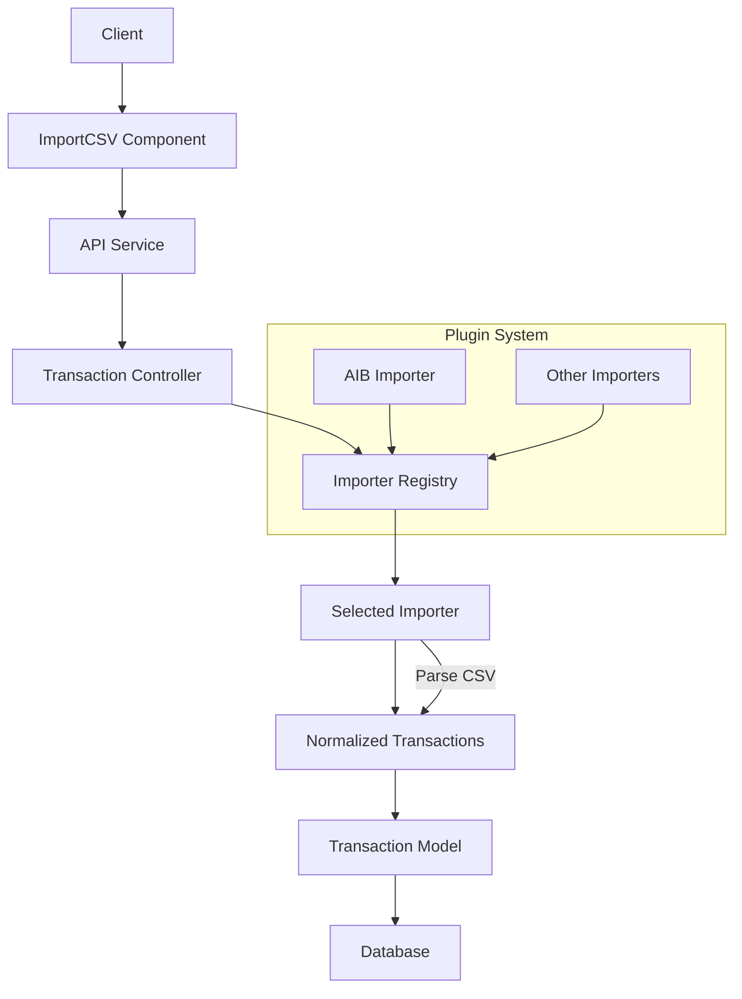
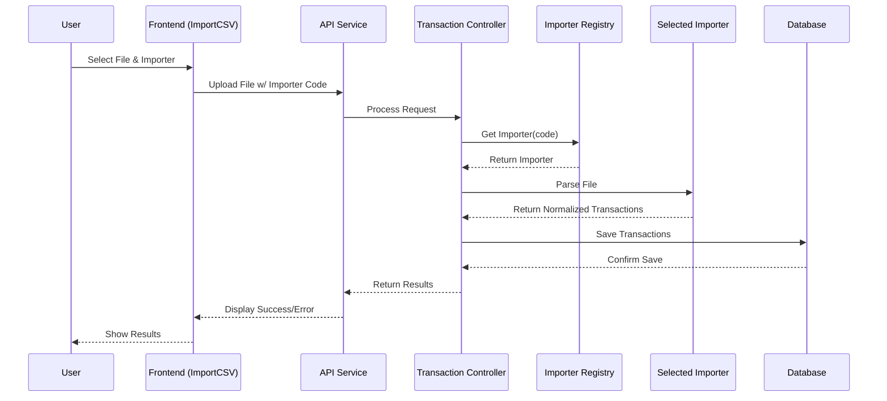

# Transaction Importer Plugin Architecture

## Overview

This document outlines the design and implementation for a plugin architecture that allows multiple transaction importers to be integrated into the finance tracker application. The current implementation directly handles CSV import in the transaction controller. This design refactors that functionality into a plugin system where importers can be dynamically registered and selected.

## Core Components

### 1. Interfaces and Types

#### TransactionImporter Interface

```typescript
interface TransactionImporter {
  name: string;                         // Display name of importer (e.g., "AIB Bank")
  code: string;                         // Unique identifier (e.g., "aib-importer")
  description?: string;                 // Optional description
  supportedFileTypes: string[];         // E.g., ['.csv']
  
  // Parse file to normalized transaction format
  parseFile(file: Buffer, options?: any): Promise<NormalizedTransaction[]>;
  
  // Optional: validate if this importer can handle a specific file
  canHandleFile?(fileHeader: string, fileName: string): Promise<boolean>;
}
```

#### NormalizedTransaction Interface

```typescript
interface NormalizedTransaction {
  accountNumber: string;
  transactionDate: string;
  description1: string;
  description2?: string;
  description3?: string;
  debitAmount?: string;
  creditAmount?: string;
  balance: string;
  currency: string;
  transactionType: string;
  localCurrencyAmount?: string;
  localCurrency?: string;
}
```

### 2. ImporterRegistry

The registry is responsible for managing the available importers:

```typescript
class ImporterRegistry {
  private static importers: Map<string, TransactionImporter> = new Map();
  
  static registerImporter(importer: TransactionImporter): void {
    this.importers.set(importer.code, importer);
  }
  
  static getImporter(code: string): TransactionImporter | undefined {
    return this.importers.get(code);
  }
  
  static getAllImporters(): TransactionImporter[] {
    return Array.from(this.importers.values());
  }
}
```

## Architecture Diagrams

### Component Diagram



### Sequence Diagram



## AIB Importer Implementation Example

The AIB importer serves as the first concrete implementation of the importer interface:

```typescript
// server/src/importers/AIBImporter.ts

import { TransactionImporter, NormalizedTransaction } from './types';
import * as csv from 'csv-parser';
import { Readable } from 'stream';
import { standardizeDate } from '../utils/dateUtils';

export class AIBImporter implements TransactionImporter {
  name = 'AIB Bank';
  code = 'aib-importer';
  description = 'Imports transactions from Allied Irish Bank CSV exports';
  supportedFileTypes = ['.csv'];
  
  /**
   * Parse AIB CSV file to normalized transaction format
   */
  async parseFile(fileBuffer: Buffer, options?: any): Promise<NormalizedTransaction[]> {
    const transactions: NormalizedTransaction[] = [];
    
    return new Promise((resolve, reject) => {
      // Create a readable stream from the buffer
      const stream = Readable.from(fileBuffer);
      
      stream
        .pipe(csv({
          mapHeaders: ({ header }) => header.trim(),
          mapValues: ({ value }) => value ? value.trim() : value
        }))
        .on('data', (row: any) => {
          // Get column value with fallback options
          const getColumnValue = (columnNames: string[]): string | undefined => {
            for (const name of columnNames) {
              if (row[name] !== undefined) return row[name] || undefined;
            }
            return undefined;
          };
          
          // Get the transaction date and standardize it
          const rawTransactionDate = getColumnValue(['Posted Transactions Date', 'PostedTransactionsDate', 'Date']) || '';
          const standardizedDate = standardizeDate(rawTransactionDate);
          
          // Map AIB CSV columns to normalized transaction format
          const transaction: NormalizedTransaction = {
            accountNumber: getColumnValue(['Posted Account', 'PostedAccount', 'Account']) || '',
            transactionDate: standardizedDate,
            description1: getColumnValue(['Description1', 'Description 1', 'Desc1']) || '',
            description2: getColumnValue(['Description2', 'Description 2', 'Desc2']) || '',
            description3: getColumnValue(['Description3', 'Description 3', 'Desc3']) || '',
            debitAmount: getColumnValue(['Debit Amount', 'DebitAmount']),
            creditAmount: getColumnValue(['Credit Amount', 'CreditAmount']),
            balance: getColumnValue(['Balance']) || '',
            currency: getColumnValue(['Posted Currency', 'PostedCurrency', 'Currency']) || '',
            transactionType: getColumnValue(['Transaction Type', 'TransactionType', 'Type']) || '',
            localCurrencyAmount: getColumnValue(['Local Currency Amount', 'LocalCurrencyAmount']),
            localCurrency: getColumnValue(['Local Currency', 'LocalCurrency'])
          };
          
          // Filter out rows that don't have essential data
          if (transaction.accountNumber || transaction.description1 || transaction.transactionDate) {
            // Skip test/dummy transactions
            if (transaction.description1 && 
                (transaction.description1.toUpperCase().includes('DUMMY') || 
                 transaction.description1.toUpperCase().includes('TEST TRANSACTION'))) {
              console.warn("AIBImporter: Skipping dummy/test transaction:", transaction.description1);
            } else {
              transactions.push(transaction);
            }
          }
        })
        .on('end', () => {
          console.log(`AIBImporter: Successfully parsed ${transactions.length} transactions`);
          resolve(transactions);
        })
        .on('error', (error: Error) => {
          console.error('AIBImporter: Error parsing CSV file:', error);
          reject(error);
        });
    });
  }
  
  /**
   * Check if file is an AIB CSV format
   */
  async canHandleFile(fileHeader: string, fileName: string): Promise<boolean> {
    // Check for AIB-specific column headers or file naming patterns
    const isAibHeader = fileHeader.includes('Posted Account') || 
                        fileHeader.includes('Posted Transactions Date') ||
                        fileHeader.includes('Description1');
                        
    const isAibFileName = fileName.toLowerCase().includes('aib') || 
                          fileName.toLowerCase().includes('allied irish bank');
    
    return isAibHeader || isAibFileName;
  }
}
```

## Creating Custom Importers

To create a custom importer for a different bank or data format:

1. Create a new file implementing the `TransactionImporter` interface
2. Register it with the `ImporterRegistry`
3. Test with sample files to ensure correct parsing

Example for creating a Bank of Ireland (BOI) importer:

```typescript
import { TransactionImporter, NormalizedTransaction } from './types';
import * as csv from 'csv-parser';
import { Readable } from 'stream';

export class BOIImporter implements TransactionImporter {
  name = 'Bank of Ireland';
  code = 'boi-importer';
  description = 'Imports transactions from Bank of Ireland CSV exports';
  supportedFileTypes = ['.csv'];
  
  async parseFile(fileBuffer: Buffer, options?: any): Promise<NormalizedTransaction[]> {
    // BOI-specific implementation
    // ...
  }
  
  async canHandleFile(fileHeader: string, fileName: string): Promise<boolean> {
    // BOI-specific detection logic
    // ...
  }
}
```

## Implementation Roadmap

### Phase 1: Core Infrastructure
- Create directory structure for importers
- Implement core interfaces and registry

### Phase 2: First Importer Implementation
- Extract current import logic into AIB importer
- Register the AIB importer

### Phase 3: Controller & API Updates
- Update transaction controller to use importers
- Add endpoint for listing available importers

### Phase 4: Frontend Integration
- Update API service with importer methods
- Add importer selection UI in ImportCSV component

### Phase 5: Testing and Documentation
- Add unit and integration tests
- Update documentation

## Directory Structure

```
server/
├── src/
│   ├── importers/
│   │   ├── index.ts                       # Exports all importers
│   │   ├── types.ts                       # Interface definitions
│   │   ├── ImporterRegistry.ts            # Registry implementation
│   │   ├── BaseImporter.ts                # Abstract base class (optional)
│   │   ├── AIBImporter.ts                 # AIB Bank importer
│   │   └── ... (other importers)
```

## Date Handling in Importers

A critical aspect of transaction importing is ensuring consistent date formats across different bank CSV exports. The Finance Tracker application implements a standardized approach to date handling within all importers:

### Standardization Process

1. **Import**: Each importer extracts raw date strings from bank-specific CSV formats
2. **Normalization**: All dates are processed through the `standardizeDate()` utility from `dateUtils.ts`
3. **Storage**: Dates are stored in the consistent YYYY-MM-DD format in the database

### Implementation Requirements

When creating custom importers, follow these requirements for date handling:

```typescript
import { standardizeDate } from '../utils/dateUtils';

// Within your importer's parseFile method:
const rawTransactionDate = getColumnValue(['Date', 'Transaction Date', 'Posted Date']); 
const standardizedDate = standardizeDate(rawTransactionDate);

// Use the standardized date in your normalized transaction
const transaction = {
  // ...other fields
  transactionDate: standardizedDate,
  // ...other fields
};
```

### Date Format Support

The `standardizeDate()` utility automatically handles various date formats:

- European format (DD/MM/YYYY)
- US format (MM/DD/YYYY) 
- ISO format (YYYY-MM-DD)
- Mixed formats with different separators (/, -)
- Dates with time components

This ensures that regardless of the bank's export format, all transaction dates will be consistently stored and processed throughout the application.

## Conclusion

This plugin architecture provides a flexible and maintainable approach to handling transaction imports from various sources. It separates the concerns of file parsing from transaction processing, making it easy to add support for new financial institutions without modifying core application code.

Benefits include:
1. **Extensibility**: Adding new importers is straightforward
2. **Consistency**: All importers produce the same normalized transaction format
3. **User Experience**: Users can select the appropriate importer or rely on auto-detection
4. **Maintainability**: Changes to one importer don't affect others
